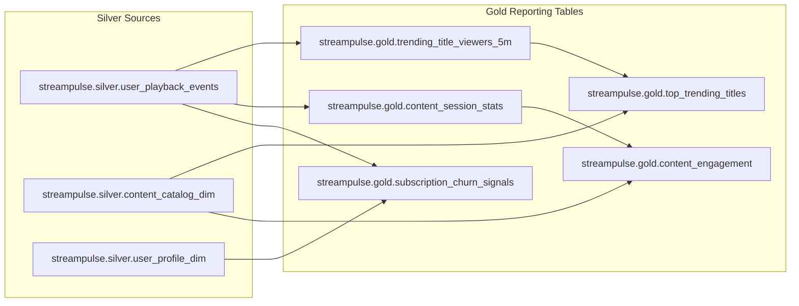

# Gold Layer Lineage Graph

This document shows how Gold reporting tables depend on Silver source tables and intermediate Gold tables.

## Dependency List

1. streampulse.gold.trending_title_viewers_5m depends on streampulse.silver.user_playback_events.
2. streampulse.gold.top_trending_titles depends on:
   - streampulse.gold.trending_title_viewers_5m
   - streampulse.silver.content_catalog_dim
3. streampulse.gold.content_session_stats depends on streampulse.silver.user_playback_events.
4. streampulse.gold.content_engagement depends on:
   - streampulse.gold.content_session_stats
   - streampulse.silver.content_catalog_dim
5. streampulse.gold.subscription_churn_signals depends on:
   - streampulse.silver.user_playback_events
   - streampulse.silver.user_profile_dim
